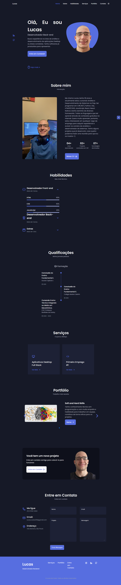

<h1 align="center">Portfólio | Lucas da Costa</h1>

Portfólio pessoal para mostrar um pouco sobre quem sou e o que faço.

  <a href="#-tecnologias">Tecnologias</a>&nbsp;&nbsp;&nbsp;|&nbsp;&nbsp;&nbsp;
  <a href="#-projeto">Projeto</a>&nbsp;&nbsp;&nbsp;|&nbsp;&nbsp;&nbsp;
  <a href="#-layout">Layout</a>&nbsp;&nbsp;&nbsp;|&nbsp;&nbsp;&nbsp;
  <a href="#memo-licença">Licença</a>

  

 

  

## 🔖 Layout

Você pode visualizar o layout do projeto através [DESSE LINK](https://lukeraa.github.io/Portfolio-Lucas-da-Costa/).

## 🚀 Tecnologias

Esse projeto foi desenvolvido com as seguintes tecnologias:

- HTML
- CSS
- JavaScript
- Git e Github

## 💻 Projeto

Esse projeto tem o objetivo de mostrar um pouco quem eu sou, além de conter informações relevantes sobre minhas habilidades, minha formação e o que ofereço para possíveis recrutadores.

## :memo: Licença

Esse projeto está sob a licença MIT.